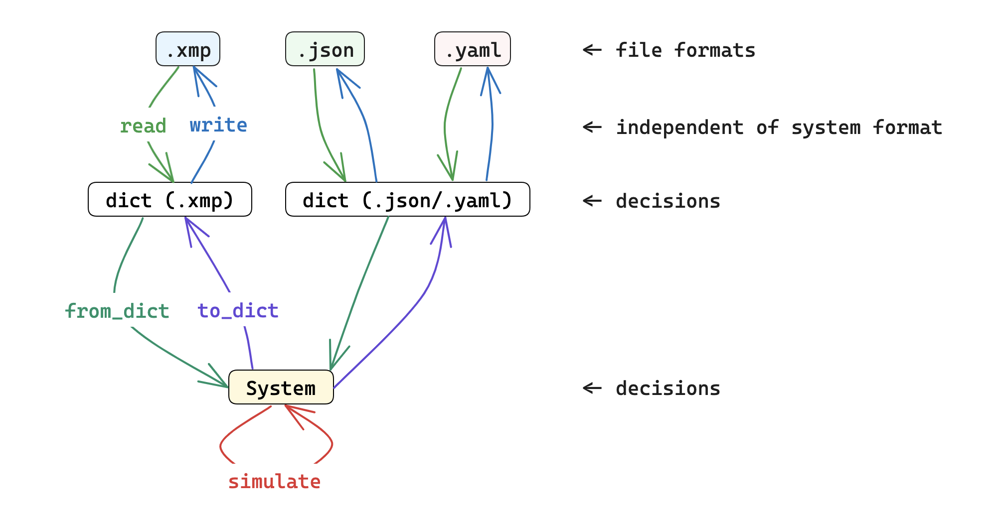

# `sn-p-factory`



Test case generator and simulator for Spiking Neural P (SN P) system simulation or analysis projects.

## Format

Recall that a vanilla SN P system is defined as a tuple $`\Pi = (\{a\}, \sigma_{1}, \sigma_{2}, \dots, \sigma_{m}, \text{syn}, \text{in}, \text{out})`$. This repo's format has a few differences:

- Neurons are grouped together into a neuron list $`N`$.
- Each neuron has a `position` field for WebSnapse compatibility.
- Instead of $`\text{in}, \text{out} \in N`$, there are dedicated input and output neurons meant to represent the **environment**; this is a property of all current WebSnapse projects to my knowledge.

The factory's types are provided in the code blocks below, TypeScript-style:

```ts
interface System {
	neurons: Neuron[];
	synapses: Synapse[];
}
```

```ts
interface Neuron {
	id: string;
	type_: "regular" | "input" | "output";
	position: Position;
	rules: Rule[];
	content: number | number[];
}
```

```ts
interface Synapse {
	from_: string;
	to: string;
	weight: number;
}
```

```ts
interface Position {
	x: number;
	y: number;
}
```

```ts
interface Rule {
	regex: string;
	consumed: number;
	produced: number;
	delay: number;
}
```

## Generation

Test case generators can be found in `src/generators`. My workflow for generation is as follows:

1. create generator
2. run generator on various inputs to produce JSON files
3. verify correctness of JSON systems
4. run converter on JSON systems, obtaining XML and YAML equivalents
5. rinse and repeat!

## Simulation

At each time step ($`t = 0, 1, 2, \dots`$), this factory's simulator does the following:

1. update spike counts
2. show state of system
3. select rules to apply
4. detect outputs
5. show state of system

Step 5 is there to reflect the changes made in Step 3.
